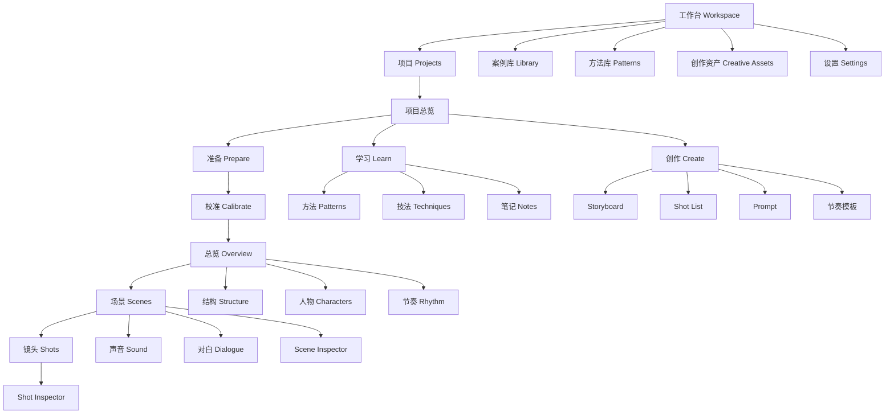
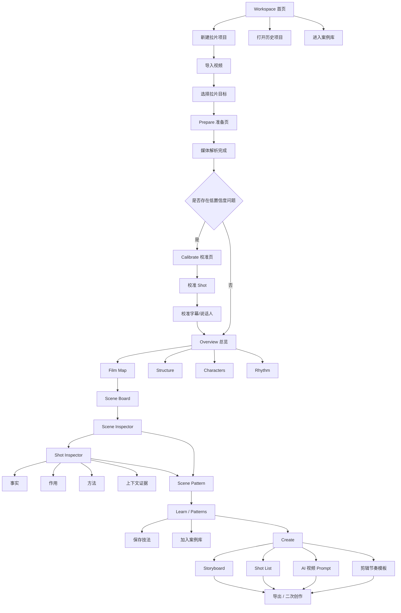

# AI 拉片平台：产品信息架构、页面流转与 UI Wireframe

> 文档目标：定义一款“专业、科学、可复用”的 AI 拉片平台，从底层拉片逻辑到用户可见 UI 流程，形成一套可直接进入产品设计、交互设计与 Figma 设计阶段的页面架构。

---

# 0. 核心设计原则

这款产品的 UI 不应该只是“把视频分析结果展示出来”，而应该通过界面本身教育用户：

> **什么叫专业拉片，应该先看什么、后看什么，哪些是事实，哪些是解释，哪些最终能够转化成创作方法。**

整个平台应同时运行两套流程：

## 0.1 平台底层拉片逻辑

```text
素材
↓
证据
↓
镜头
↓
场景
↓
结构
↓
解释
↓
规律
↓
创作资产
```

更完整地表示：

```text
Video
↓
媒体解析
↓
ASR / OCR / 音频 / 帧索引
↓
Shot Detection
↓
Shot 校正
↓
Shot Enrichment
↓
Scene Segmentation
↓
Film Structure
↓
Scene 深度分析
↓
Shot-by-Shot Analysis
↓
Cross-shot Pattern
↓
Knowledge Extraction
↓
Creative Reuse
```

## 0.2 用户可见操作流程

```text
准备 Prepare
↓
校准 Calibrate
↓
总览 Overview
↓
深拆 Analyze
↓
沉淀 Learn
↓
创作 Create
```

两者必须一一映射，但不能把算法流程直接暴露给用户。

---

# 1. 产品信息架构 IA

## 1.1 一级信息架构



---

## 1.2 左侧导航结构

建议左侧导航不要按照“功能工具箱”组织，而要按照“理解 → 分析 → 学习 → 创作”的认知路径组织。

```text
← Projects

当前项目
Parasite / 地下室场景

────────────────────

OVERVIEW
⌁ Film Map
◇ Structure
♙ Characters
⌁ Rhythm

ANALYZE
▦ Scenes
▤ Shots
♫ Sound
▱ Dialogue

LEARN
✦ Patterns
▰ Techniques
□ Notes

CREATE
◇ Storyboard
▤ Shot List
✦ Prompts
⌁ Rhythm Template
```

这个导航本身就在持续告诉用户：

> **你不是在“看 AI 报告”，你是在理解 → 分析 → 提炼 → 创作。**

---

# 2. 页面层级

平台页面建议划分为 4 个层级：

| 层级 | 页面 | 目标 |
|---|---|---|
| Workspace | 首页 / 项目列表 / 案例库 | 管理素材与学习资产 |
| Project | 准备 / 校准 / 总览 | 完成一次拉片的主流程 |
| Analyze | Scene / Shot / Sound / Dialogue | 进入视频内部理解 |
| Learn & Create | Pattern / Technique / Storyboard / Shot List | 把分析转化为长期资产 |

---

# 3. 完整页面流转图



---

# 4. 首次进入：Workspace 首页

## 页面目标

让用户明确知道三件事：

1. 我可以开始一个新的拉片项目。
2. 我以前拆过的内容不会消失。
3. 我的方法论和案例会不断积累。

## Wireframe

```text
┌───────────────────────────────────────────────────────────────────────┐
│ LOGO                      搜索项目 / 镜头 / 技法              [头像] │
├───────────────────────────────────────────────────────────────────────┤
│                                                                       │
│  早上好                                                             │
│  今天想拆什么？                                                      │
│                                                                       │
│  ┌──────────────────────────┐     ┌──────────────────────────┐        │
│  │ + 新建拉片项目           │     │ 导入在线视频 / 本地视频  │        │
│  │                          │     │                          │        │
│  │ 从一条视频开始理解       │     │ YouTube / 文件 / URL     │        │
│  └──────────────────────────┘     └──────────────────────────┘        │
│                                                                       │
│  最近项目                                                             │
│  ┌──────────────┐ ┌──────────────┐ ┌──────────────┐                  │
│  │ Parasite     │ │ Apple Ad     │ │ TikTok Demo  │                  │
│  │ 78% 已完成   │ │ 已完成       │ │ 分析中       │                  │
│  │ 186 Shots    │ │ 62 Shots     │ │ 34 Shots     │                  │
│  └──────────────┘ └──────────────┘ └──────────────┘                  │
│                                                                       │
│  我的知识                                                             │
│  128 个案例  ·  36 个方法  ·  12 个节奏模板                          │
│                                                                       │
└───────────────────────────────────────────────────────────────────────┘
```

## 关键设计

首页不要变成 SaaS Dashboard。

最主要 CTA 永远是：

> **新建拉片项目**

知识库资产则应该被持续展示，让用户意识到：

> 每一次拉片都会增加自己的“导演/剪辑脑库”。

---

# 5. 新建项目：选择拉片目标

## 页面目标

在分析之前确定：

> **为什么拉？**

这是整个产品最关键的“专业分流”。

## Wireframe

```text
┌──────────────────────────────────────────────────────────────────────┐
│ ← 返回                  新建拉片项目                                  │
├──────────────────────────────────────────────────────────────────────┤
│                                                                      │
│  你想从这条视频里学什么？                                            │
│                                                                      │
│  ┌──────────────────┐ ┌──────────────────┐ ┌──────────────────┐     │
│  │ 导演 / 叙事      │ │ 摄影 / 镜头语言  │ │ 剪辑 / 节奏      │     │
│  │                  │ │                  │ │                  │     │
│  │ 场面调度         │ │ 景别 / 机位      │ │ 切镜 / 节奏      │     │
│  │ 人物 / 冲突      │ │ 运镜 / 构图      │ │ J/L Cut          │     │
│  └──────────────────┘ └──────────────────┘ └──────────────────┘     │
│                                                                      │
│  ┌──────────────────┐ ┌──────────────────┐ ┌──────────────────┐     │
│  │ 短视频爆款       │ │ 广告 / 商业      │ │ AI 视频复刻      │     │
│  │ Hook / Payoff    │ │ 卖点 / 节奏      │ │ Prompt / Shot    │     │
│  └──────────────────┘ └──────────────────┘ └──────────────────┘     │
│                                                                      │
│  自定义目标                                                          │
│  [________________________________________________________]          │
│                                                                      │
│                                             [下一步：导入视频 →]      │
└──────────────────────────────────────────────────────────────────────┘
```

## 产品逻辑

选择目标之后：

- 调整默认分析字段
- 调整 Overview 的指标
- 调整 AI 分析 Prompt
- 调整最终输出资产

例如：

### “剪辑 / 节奏”

优先展示：

- Shot Duration
- Cut Density
- J/L Cut
- 音桥
- 动作匹配
- 节奏变化

### “导演 / 叙事”

优先展示：

- Scene Objective
- Conflict
- Character Motivation
- Blocking
- Narrative Function
- POV

---

# 6. Prepare：准备页面

## 页面目标

让用户产生：

> **系统正在建立这条视频的“证据地图”。**

而不是模糊的：

> AI 正在分析。

## Wireframe

```text
┌───────────────────────────────────────────────────────────────────────┐
│ ← Projects          Parasite                       Prepare  Step 1/5 │
├───────────────────────────────────────────────────────────────────────┤
│                                                                       │
│  正在建立影片地图                                                     │
│  ━━━━━━━━━━━━━━━━━━━━━━━━━━━━━━━━━━━━━━━━━━━━━━━ 78%                  │
│                                                                       │
│  ✓ 视频结构         02:12:46                                          │
│  ✓ 音轨             2 tracks                                          │
│  ✓ 字幕             1,843 lines                                       │
│  ✓ 镜头候选         1,286 shots                                       │
│  ✓ 音频波形         Ready                                             │
│  ● 人物 / 地点索引  Processing...                                     │
│  ○ 场景聚类         Waiting                                           │
│                                                                       │
│  ┌───────────────────────────────────────────────────────────────┐    │
│  │                    Video Preview                              │    │
│  │                                                               │    │
│  │                      [video]                                  │    │
│  └───────────────────────────────────────────────────────────────┘    │
│                                                                       │
│  视频信息                                                             │
│  24fps · 1080p · H264 · 2:12:46 · Stereo                             │
│                                                                       │
│                                         [后台继续] [查看分析详情]     │
└───────────────────────────────────────────────────────────────────────┘
```

## 状态设计

建议显示“用户可理解的处理项”：

- 视频结构
- 音轨
- 字幕
- 镜头候选
- 人物/地点
- 场景候选

不展示：

- Model Name
- Embedding
- Token
- GPU Job

除非用户打开 Advanced Details。

---

# 7. Calibrate：校准页面

## 页面目标

把所有机器低置信度结果集中给用户快速确认。

产品理念：

> **AI 处理 95%，人只确认 5%。**

---

## 7.1 Shot 校准 Wireframe

```text
┌────────────────────────────────────────────────────────────────────────┐
│ Parasite        Prepare ✓   Calibrate ●   Overview ○   Analyze ○       │
├────────────────────────────────────────────────────────────────────────┤
│                                                                        │
│  镜头校准                         需要检查 7 / 1,286                    │
│                                                                        │
│ ┌────────────────────────────────────────────────────────────────────┐ │
│ │                            PLAYER                                  │ │
│ │                                                                    │ │
│ │                          00:32:14.080                              │ │
│ └────────────────────────────────────────────────────────────────────┘ │
│                                                                        │
│  Timeline                                                              │
│  ─────[S218]─────│─────[S219]──────[S220]────────────────────────     │
│                  ↑                                                     │
│           可疑切点 · 63%                                               │
│                                                                        │
│  [合并前后镜头]      [在播放头切开]      [确认切点 ✓]                 │
│                                                                        │
│  原因：快速运动可能导致误切                                            │
│                                                                        │
│                         ← 上一个异常          下一个异常 →             │
└────────────────────────────────────────────────────────────────────────┘
```

---

## 7.2 字幕校准

```text
┌───────────────────────────────────────────────────────────────────────┐
│ 字幕 / 说话人校准                                                     │
├───────────────────────────────────────────────────────────────────────┤
│                                                                       │
│  00:32:13.200 ────────────────────── 00:32:18.900                     │
│                                                                       │
│  Person A                                                              │
│  “你真的知道这意味着什么吗？”                                         │
│                                                                       │
│  [播放这句] [调整起点] [调整终点] [更换说话人]                        │
│                                                                       │
│  AI Confidence 71%                                                     │
│                                                                       │
│                            [确认] [下一条]                             │
└───────────────────────────────────────────────────────────────────────┘
```

---

# 8. Overview：全片总览

## 页面目标

让用户在 30 秒内回答：

> **“这条视频整体是怎么组织起来的？”**

这一页是整个产品的“上帝视角”。

## Wireframe

```text
┌────────────────────────────────────────────────────────────────────────────┐
│ ☰  Parasite                     Overview                [Search] [Share]   │
├──────────────┬─────────────────────────────────────────────────────────────┤
│              │                                                             │
│ OVERVIEW     │  Film Map                                                   │
│ ● Film Map   │                                                             │
│ ◇ Structure  │  00:00                                           02:12:46   │
│ ♙ Characters │  │────────────────────────────────────────────────────│     │
│ ⌁ Rhythm     │  SETUP        DEVELOPMENT       CRISIS      CLIMAX    END   │
│              │                                                             │
│ ANALYZE      │  ┌────────┐ ┌─────────┐ ┌────────┐ ┌──────────┐             │
│ ▦ Scenes     │  │Scene 1 │ │Scene 2  │ │Scene 3 │ │Scene 4   │ ...         │
│ ▤ Shots      │  │01:23   │ │02:44    │ │04:15   │ │03:48     │             │
│ ♫ Sound      │  └────────┘ └─────────┘ └────────┘ └──────────┘             │
│ ▱ Dialogue   │                                                             │
│              │  Emotion                                                    │
│ LEARN        │  ▁▂▂▃▄▅▅▆▇██▆▅▄▆██▇▃▂                                    │
│ ✦ Patterns   │                                                             │
│ ▰ Techniques │  Cut Density                                                │
│ □ Notes      │  ▁▁▂▂▃▄▇██▇▄▃▂▅▇██▇                                      │
│              │                                                             │
│ CREATE       │  Key Characters                                             │
│ ◇ Storyboard │  [Ki-woo] [Ki-taek] [Mr. Park] [Jessica]                   │
│ ▤ Shot List  │                                                             │
│ ✦ Prompts    │                                                             │
└──────────────┴─────────────────────────────────────────────────────────────┘
```

---

# 9. Film Map

Film Map 不应该只是 Timeline。

应该同时表达：

1. 时间
2. Scene
3. Narrative Beat
4. Character Thread
5. Emotion
6. Cut Density

## 推荐结构

```text
TIME
────────────────────────────────────────────────────────>

STORY
[Setup]────────[Inciting]────[Conflict]────[Climax]────[Resolution]

SCENE
[S01][S02][S03][S04][S05][S06][S07][S08][S09]

CHARACTER A
━━━━━━━      ━━━━━━━━━━━━━            ━━━━━━━━━

CHARACTER B
       ━━━━━━━━━━━        ━━━━━━━━━━━━━━━━━

EMOTION
▁▂▃▃▄▅▆██▇▅▄

CUT DENSITY
▂▂▂▃▄▆███▅▄▃
```

用户点击任意 Scene，即进入 Scene Board。

---

# 10. Structure：结构页面

## 页面目标

让用户看到：

> **故事结构是如何被安排出来的。**

Wireframe：

```text
┌──────────────────────────────────────────────────────────────────────┐
│ Structure                                                            │
├──────────────────────────────────────────────────────────────────────┤
│                                                                      │
│  Narrative Structure                                                 │
│                                                                      │
│  01 SETUP                                                            │
│  ┌───────────────────────────────────────────────────────────────┐   │
│  │ 建立家庭状态、贫穷环境和人物目标                              │   │
│  │ Scene 01 → Scene 05                                            │   │
│  └───────────────────────────────────────────────────────────────┘   │
│                      ↓                                               │
│  02 INCITING INCIDENT                                               │
│  ┌───────────────────────────────────────────────────────────────┐   │
│  │ Ki-woo 获得家教机会                                           │   │
│  └───────────────────────────────────────────────────────────────┘   │
│                      ↓                                               │
│  03 ESCALATION                                                      │
│  ...                                                                 │
│                                                                      │
│  [切换：三幕结构 / Beat Sheet / 自定义结构]                         │
└──────────────────────────────────────────────────────────────────────┘
```

---

# 11. Scenes：Scene Board

## 页面目标

场景是最适合人理解影片的中间层。

不是直接扔给用户 1,000 个 Shot。

## Wireframe

```text
┌─────────────────────────────────────────────────────────────────────────┐
│ Scenes                       23 Scenes                [Grid] [Timeline]  │
├─────────────────────────────────────────────────────────────────────────┤
│                                                                         │
│ ┌──────────────────────┐ ┌──────────────────────┐ ┌──────────────────┐ │
│ │ [key frame]          │ │ [key frame]          │ │ [key frame]      │ │
│ │                      │ │                      │ │                  │ │
│ │ SCENE 01             │ │ SCENE 02             │ │ SCENE 03         │ │
│ │ Basement / Family    │ │ Street / Ki-woo      │ │ Park House       │ │
│ │ 01:32 · 14 shots     │ │ 00:48 · 9 shots      │ │ 03:12 · 37 shots │ │
│ │                      │ │                      │ │                  │ │
│ │ 建立家庭与环境       │ │ 新机会出现           │ │ 第一次进入豪宅   │ │
│ └──────────────────────┘ └──────────────────────┘ └──────────────────┘ │
│                                                                         │
└─────────────────────────────────────────────────────────────────────────┘
```

---

# 12. Scene Inspector

这是核心页面之一。

## 页面目标

回答：

> **这一场为什么成立？**

## 推荐布局

```text
┌────────────────────────────────────────────────────────────────────────────┐
│ Scene 08 · Basement Dinner                           [上一场] [下一场]      │
├──────────────────────────────────────┬─────────────────────────────────────┤
│                                      │ Scene Analysis                      │
│              VIDEO                   │                                     │
│                                      │ 目标 Objective                      │
│                                      │ 家庭第一次获得短暂的胜利感           │
│                                      │                                     │
│                                      │ 冲突 Conflict                       │
│                                      │ 表面放松 vs 潜在阶级风险             │
│                                      │                                     │
├──────────────────────────────────────┤ 转折 Beat                           │
│ Shot Strip                           │ 门铃响起                             │
│ [01][02][03][04][05][06][07][08]   │                                     │
│                                      │ 为什么重要                          │
│                                      │ 由安全状态瞬间切换到威胁             │
├──────────────────────────────────────┴─────────────────────────────────────┤
│ Dialogue       Music          SFX            Beat / Event                   │
│ ───────────────────────────────────────────────────────────────────────── │
│      “...”        ♪──────         doorbell ●                               │
└────────────────────────────────────────────────────────────────────────────┘
```

---

# 13. Shot Inspector

这是最重要的专业页面。

## 页面目标

回答三个问题：

1. **发生了什么？**
2. **为什么这样设计？**
3. **我什么时候可以复用？**

---

## Wireframe

```text
┌──────────────────────────────────────────────────────────────────────────────┐
│ Scene 08 / Shot 037                                  01:32.450 → 01:35.820 │
├───────────────────────────────────────────┬──────────────────────────────────┤
│                                           │ SHOT 037                         │
│                                           │ 3.37 sec                         │
│                  VIDEO                    │                                  │
│                                           │ FACTS                            │
│                                           │ ───────────────────────────────  │
│                                           │ Shot Size      MCU               │
│                                           │ Angle          Slight Low        │
│                                           │ Movement       Slow Push-in      │
│                                           │ Character      Ki-taek           │
│                                           │ Dialogue       “……”              │
│                                           │                                  │
├───────────────────────────────────────────┤ FUNCTION                         │
│ Previous        Current        Next       │ ───────────────────────────────  │
│ [frame]         [frame]        [frame]    │ Narrative      Turning Point     │
│                                           │ Emotion        Guarded → Accept  │
│                                           │ Attention      Face              │
├───────────────────────────────────────────┤                                  │
│ Timeline                                  │ WHY IT WORKS                     │
│ ──────│────────●─────────│──────────      │ ───────────────────────────────  │
│ Dialogue      BGM        SFX              │ 镜头运动先于台词开始，             │
│                                           │ 让心理变化先被视觉感知。           │
│                                           │                                  │
│                                           │ REUSABLE PATTERN                 │
│                                           │ ───────────────────────────────  │
│                                           │ 人物从隐瞒走向承认时，             │
│                                           │ 可用渐近运动代替直接切特写。       │
│                                           │                                  │
│                                           │ [保存为技法] [+ 加入案例库]       │
└───────────────────────────────────────────┴──────────────────────────────────┘
```

---

# 14. Shot Inspector 的四层信息模型

右侧 Inspector 建议固定为以下顺序：

## 14.1 Evidence / Evidence First

所有分析首先绑定证据：

- 关键帧
- 时间码
- 台词
- OCR
- 波形
- 前后 Shot
- Micro Clip

## 14.2 Facts

尽量由专用模型或确定性算法生成：

- Shot Size
- Camera Angle
- Camera Movement
- Duration
- Character
- Dialogue
- Audio
- Transition

## 14.3 Interpretation

AI 进行解释：

- Narrative Function
- Emotion Change
- Audience Attention
- Information Change
- Dramatic Purpose

## 14.4 Reusable Pattern

最终转为可学习方法：

> **什么时候使用、为什么有效、需要什么条件。**

---

# 15. Shots：镜头浏览页

## 页面目标

用于宏观查看所有镜头，而不是进行深度分析。

```text
┌────────────────────────────────────────────────────────────────────────┐
│ Shots               1,286 shots       Filter ▼     Search              │
├────────────────────────────────────────────────────────────────────────┤
│                                                                        │
│ [frame] [frame] [frame] [frame] [frame] [frame]                       │
│  S001    S002    S003    S004    S005    S006                         │
│  2.4s    1.3s    4.8s    0.9s    2.1s    6.2s                         │
│  WS      MS      MCU     CU      MS      MCU                           │
│                                                                        │
│ [frame] [frame] [frame] [frame] [frame] [frame]                       │
│                                                                        │
│ Filter:                                                               │
│ [Shot Size] [Movement] [Character] [Duration] [Scene] [Technique]     │
└────────────────────────────────────────────────────────────────────────┘
```

这个页面未来也是案例检索能力的基础。

---

# 16. Rhythm：节奏分析页

## 页面目标

让用户看到剪辑节奏，而不是只读结论。

```text
┌──────────────────────────────────────────────────────────────────────┐
│ Rhythm                                                               │
├──────────────────────────────────────────────────────────────────────┤
│                                                                      │
│ Shot Duration                                                        │
│ 8s ┤                                                                 │
│ 6s ┤        ╭─╮                                                      │
│ 4s ┤ ╭─╮  ╭─╯ ╰╮                                                     │
│ 2s ┤─╯ ╰──╯     ╰────╮    ╭────                                     │
│ 0s ┼────────────────────────────────────────────────────────────      │
│                                                                      │
│ Cut Density                                                          │
│ ▁▁▂▃▄▆███▇▄▃▂▅▇██▇                                               │
│                                                                      │
│ AI Finding                                                           │
│ ┌───────────────────────────────────────────────────────────────┐    │
│ │ 冲突升级前 42 秒内，平均 Shot Duration 从 4.6s 降到 1.3s。   │    │
│ │ 高潮到来时反而保持一个 6.2s 长镜头。                         │    │
│ │                                                               │    │
│ │ [查看证据片段]                                                │    │
│ └───────────────────────────────────────────────────────────────┘    │
└──────────────────────────────────────────────────────────────────────┘
```

---

# 17. Sound：声音分析页

声音不能只是一个字段。

建议独立页面：

```text
┌────────────────────────────────────────────────────────────────────────┐
│ Sound                                                                  │
├────────────────────────────────────────────────────────────────────────┤
│                                                                        │
│ VIDEO                                                                  │
│ ┌────────────────────────────────────────────────────────────────────┐ │
│ │                                                                    │ │
│ └────────────────────────────────────────────────────────────────────┘ │
│                                                                        │
│ DIALOGUE  ─────████──────────█████────────────                         │
│ MUSIC     ─────────████████████────────████────                        │
│ SFX       ───●────────────●───────●────────────────                    │
│ AMBIENCE  ─────────────────────────────────────────                    │
│                                                                        │
│ Key Sound Events                                                       │
│ 01:12:04  BGM disappears                                               │
│ 01:12:07  Doorbell                                                     │
│ 01:12:08  Dialogue silence                                             │
│                                                                        │
│ Finding                                                                │
│ “高潮前通过抽掉 BGM 制造听觉真空。”                                   │
└────────────────────────────────────────────────────────────────────────┘
```

---

# 18. Characters：人物页面

人物不是单纯识别人脸。

应该围绕：

- 出场
- 关系
- POV
- Scene
- Conflict
- Emotional Arc

组织。

```text
┌──────────────────────────────────────────────────────────────────────┐
│ Characters                                                           │
├──────────────────────────────────────────────────────────────────────┤
│                                                                      │
│ [portrait] Ki-woo                                                    │
│                                                                      │
│ 出场          38 scenes                                              │
│ Screen Time   41m 32s                                                │
│ POV Shots     63                                                     │
│                                                                      │
│ Character Arc                                                        │
│ Hope ───── Ambition ───── Control ───── Crisis ───── Collapse        │
│                                                                      │
│ Relationship                                                         │
│ Ki-taek ───────── Father                                             │
│ Mr. Park ──────── Employer                                           │
│                                                                      │
│ [查看所有相关场景] [查看所有 POV 镜头]                               │
└──────────────────────────────────────────────────────────────────────┘
```

---

# 19. Learn：Patterns 页面

这是产品长期价值的开始。

## 页面目标

把一次性分析变成：

> **方法库。**

## Wireframe

```text
┌────────────────────────────────────────────────────────────────────────┐
│ Patterns                         7 extracted patterns                   │
├────────────────────────────────────────────────────────────────────────┤
│                                                                        │
│ 01  高潮前缩短镜头时长                                                 │
│ ┌────────────────────────────────────────────────────────────────────┐ │
│ │ Context                                                            │ │
│ │ 冲突持续升级，但真正爆发尚未发生                                   │ │
│ │                                                                    │ │
│ │ Pattern                                                            │ │
│ │ 4.2s → 3.1s → 1.8s → 0.9s                                       │ │
│ │                                                                    │ │
│ │ Effect                                                             │ │
│ │ 提高心理压力                                                       │ │
│ │                                                                    │ │
│ │ Use When                                                           │ │
│ │ 希望观众感觉“事情即将失控”                                        │ │
│ │                                                                    │ │
│ │ [证据 4 个镜头]     [保存为技法]     [创建 Shot List]             │ │
│ └────────────────────────────────────────────────────────────────────┘ │
│                                                                        │
└────────────────────────────────────────────────────────────────────────┘
```

---

# 20. Techniques：个人技法库

Pattern 是 AI 从当前项目提取的。

Technique 是用户确认以后，进入长期资产库的内容。

```text
Technique
────────────────────

名称
高潮前压缩镜头时长

类型
Editing / Rhythm

适用条件
冲突已经建立但尚未爆发

方法
逐步降低 Shot Duration

效果
提高紧张感 / 预期感

案例
Parasite / Scene 18
Whiplash / Scene 06
Apple Ad / 00:18

我的笔记
……
```

这就是用户个人的“导演知识库”。

---

# 21. Create：Storyboard

从分析进入创作。

```text
┌────────────────────────────────────────────────────────────────────────┐
│ Create / Storyboard                                                    │
├────────────────────────────────────────────────────────────────────────┤
│                                                                        │
│ 基于技法：高潮前压缩镜头时长                                          │
│                                                                        │
│ ┌───────────┐ ┌───────────┐ ┌───────────┐ ┌───────────┐              │
│ │ Frame 01  │ │ Frame 02  │ │ Frame 03  │ │ Frame 04  │              │
│ │           │ │           │ │           │ │           │              │
│ └───────────┘ └───────────┘ └───────────┘ └───────────┘              │
│    4.0s          2.8s          1.6s          0.8s                     │
│                                                                        │
│ [重新生成构图] [改变角色] [改变场景] [导出 Storyboard]               │
└────────────────────────────────────────────────────────────────────────┘
```

---

# 22. Create：Shot List

```text
┌──────────────────────────────────────────────────────────────────────────┐
│ Shot List                                                               │
├────┬─────────┬──────────┬──────────┬───────────┬────────────────────────┤
│ #  │ Shot    │ Duration │ Movement │ Subject   │ Purpose                │
├────┼─────────┼──────────┼──────────┼───────────┼────────────────────────┤
│ 01 │ WS      │ 4.0s     │ Static   │ Character │ Establish             │
│ 02 │ MS      │ 2.8s     │ Push     │ Character │ Escalate              │
│ 03 │ MCU     │ 1.6s     │ Push     │ Character │ Pressure              │
│ 04 │ CU      │ 0.8s     │ Static   │ Eyes      │ Peak tension          │
└────┴─────────┴──────────┴──────────┴───────────┴────────────────────────┘
```

---

# 23. Create：Prompt

如果用户目标是 AI 视频创作，可以将“镜头分析”直接转为生成 Prompt。

注意这里的 Prompt 不应该只是把视觉描述翻译成英文。

而应该包含：

- Shot Size
- Camera Position
- Movement
- Subject Action
- Lighting
- Temporal Rhythm
- Transition
- Emotional Function

```text
SHOT 03

Medium close-up.
Camera slowly pushes toward the character.
The character remains still while eye movement reveals anxiety.
Low-key lighting.
Background remains soft and visually compressed.
Duration: approximately 1.6 seconds.
Narrative function: escalate tension before revelation.
```

---

# 24. 案例库 Library

案例库必须跨项目存在。

## 页面目标

回答：

> **我以前见过哪些类似做法？**

## Wireframe

```text
┌──────────────────────────────────────────────────────────────────────────┐
│ Case Library                         Search: [音桥转场____________]       │
├──────────────────────────────────────────────────────────────────────────┤
│                                                                          │
│ Filters                                                                  │
│ Film / Ad / Short Video                                                  │
│ Shot Size / Movement / Scene / Pattern / Character / Sound              │
│                                                                          │
│ Results                                                                  │
│                                                                          │
│ [frame] Parasite · Scene 18 · Audio Bridge                              │
│ 00:58:12 → 00:58:19                                                      │
│ “对白提前进入下一场，引导空间转换。”                                    │
│                                                                          │
│ [frame] Whiplash · Scene 06 · Audio Bridge                              │
│ ……                                                                       │
│                                                                          │
└──────────────────────────────────────────────────────────────────────────┘
```

最终应支持自然语言检索：

> 找我以前拆过的所有“对白先进入下一场”的案例。

---

# 25. 全局搜索

搜索不只是找项目。

它应该是视频知识库入口。

```text
Search
────────────────────────────

“角色承认真相之前慢慢推近”

Results

Techniques
• 渐近镜头强化心理承认

Shots
• Parasite / Shot 037
• Burning / Shot 291

Scenes
• Whiplash / Practice Room

Notes
• 我的笔记……
```

---

# 26. 全局交互模式

产品建议始终保留三种粒度：

```text
FILM
↓
SCENE
↓
SHOT
```

用户永远知道自己当前在哪一层。

面包屑：

```text
Parasite
/
Scene 08 Basement Dinner
/
Shot 037
```

这是避免“分析迷路”的核心机制。

---

# 27. UI 信息密度原则

专业不等于信息堆积。

建议遵循：

## Film 层

展示：

- 结构
- 节奏
- 人物
- Scene

不展示大量单镜头字段。

## Scene 层

展示：

- Shot Sequence
- Dialogue
- Sound
- Narrative Beat
- Conflict
- Cross-shot Pattern

## Shot 层

展示：

- Frame
- Technical Facts
- Narrative Function
- Evidence
- Reusable Pattern

---

# 28. AI 的 UI 呈现原则

不要出现一个巨大的：

> “Ask AI”

作为产品核心。

AI 应该嵌在结构里。

例如：

```text
FACT
Shot Size: MCU
Confidence: 96%
```

```text
INTERPRETATION
Narrative Function: Turning Point
AI hypothesis
```

```text
WHY IT WORKS
……
[查看依据]
```

让用户明确知道：

- 什么是机器识别事实
- 什么是 AI 推理
- 什么是人的判断

---

# 29. 可信度设计

专业产品应该把“不确定性”展示出来。

例如：

```text
Shot Boundary
Confidence 97%

Speaker
Confidence 62%
[Confirm]

Narrative Function
AI Interpretation
[Agree] [Edit]
```

产品原则：

> **不掩盖 AI 不确定性。**

这反而会提升用户信任。

---

# 30. 空状态设计

用户第一次进入 Patterns：

```text
你还没有保存任何方法。

完成一次 Scene 深拆后，
系统会自动提取可以带走的创作方法。

[去分析 Scene]
```

而不是：

> No data.

---

# 31. 进度设计

顶栏可以持续显示：

```text
Prepare ✓
Calibrate ✓
Overview ✓
Analyze 68%
Learn 4 patterns
```

但不要强制用户必须线性完成。

专业用户应该允许：

- 跳过
- 返回
- 修改
- 重跑部分分析

---

# 32. 项目状态模型

建议项目状态至少包括：

```text
Imported
↓
Processing
↓
Needs Calibration
↓
Ready
↓
Analyzing
↓
Reviewed
↓
Knowledge Extracted
```

每个状态对应 UI 行为。

---

# 33. 核心页面关系

最终产品最核心的页面其实只有五个：

```text
PROJECT HOME
     ↓
OVERVIEW
     ↓
SCENE BOARD
     ↓
SHOT INSPECTOR
     ↓
PATTERN / CREATE
```

其他页面都围绕这条主链服务。

---

# 34. 主流程 Wireflow

```text
┌──────────────┐
│  Workspace   │
└──────┬───────┘
       │ New Project
       ▼
┌──────────────┐
│   Purpose    │
│ 为什么拉片？│
└──────┬───────┘
       ▼
┌──────────────┐
│   Prepare    │
│ 建立影片地图│
└──────┬───────┘
       ▼
┌──────────────┐
│  Calibrate   │
│ 确认证据层   │
└──────┬───────┘
       ▼
┌──────────────┐
│   Overview   │
│ 理解整部视频│
└──────┬───────┘
       │ Click Scene
       ▼
┌──────────────┐
│ Scene Board  │
│ 理解一场戏   │
└──────┬───────┘
       │ Click Shot
       ▼
┌──────────────┐
│Shot Inspector│
│理解一个决定 │
└──────┬───────┘
       │ Extract
       ▼
┌──────────────┐
│   Pattern    │
│ 提炼方法     │
└──────┬───────┘
       │ Apply
       ▼
┌──────────────┐
│    Create    │
│ 转为创作资产│
└──────────────┘
```

---

# 35. 产品核心闭环

最终闭环不是：

```text
Upload
→ Analyze
→ Report
```

而应该是：

```text
WATCH
↓
UNDERSTAND
↓
VERIFY
↓
ANALYZE
↓
EXTRACT
↓
REMEMBER
↓
REUSE
```

中文：

```text
看
↓
理解
↓
验证
↓
分析
↓
提炼
↓
记住
↓
复用
```

---

# 36. 设计哲学

一款真正专业的 AI 拉片产品，应该做到：

## 36.1 用户永远知道当前处于哪一层

```text
Film
Scene
Shot
```

## 36.2 用户永远知道当前看到的是什么类型的信息

```text
Fact
Interpretation
Pattern
```

## 36.3 用户永远知道下一步为什么值得做

```text
校准 → 让分析更可靠
总览 → 建立全局理解
深拆 → 理解创作决定
提炼 → 获得可迁移方法
创作 → 应用到自己的作品
```

---

# 37. 最终产品定义

这款产品不应该被定义成：

> **AI 视频分析工具**

更好的定义是：

> **一套把成片反向编译成创作决策的专业工作台。**

其底层逻辑：

> **证据 → 结构 → 解释 → 方法**

其 UI 引导流程：

> **准备 → 校准 → 总览 → 深拆 → 沉淀 → 创作**

其长期价值：

> **每拉一部片，就让用户自己的创作知识库变强一点。**

最终用户打开这款产品时，不只是“使用工具”。

而是在跟随一套清晰的专业拉片方法进行学习：

> **Film → Scene → Shot → Evidence → Interpretation → Pattern → Creation**

这套方法论本身，就是产品最重要的壁垒之一。
